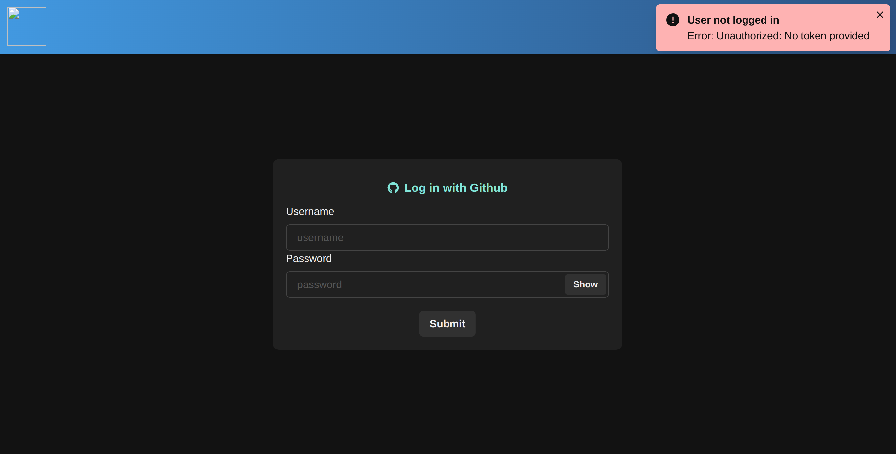
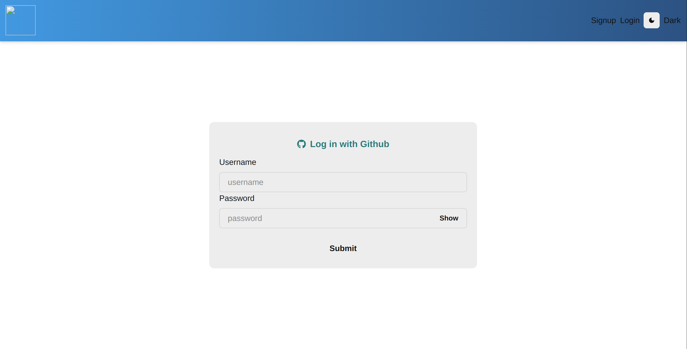
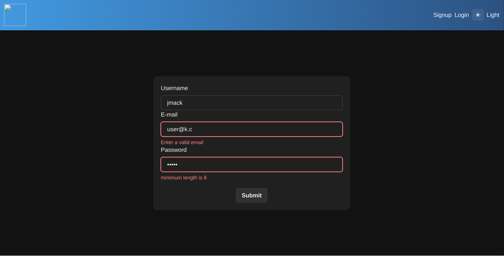
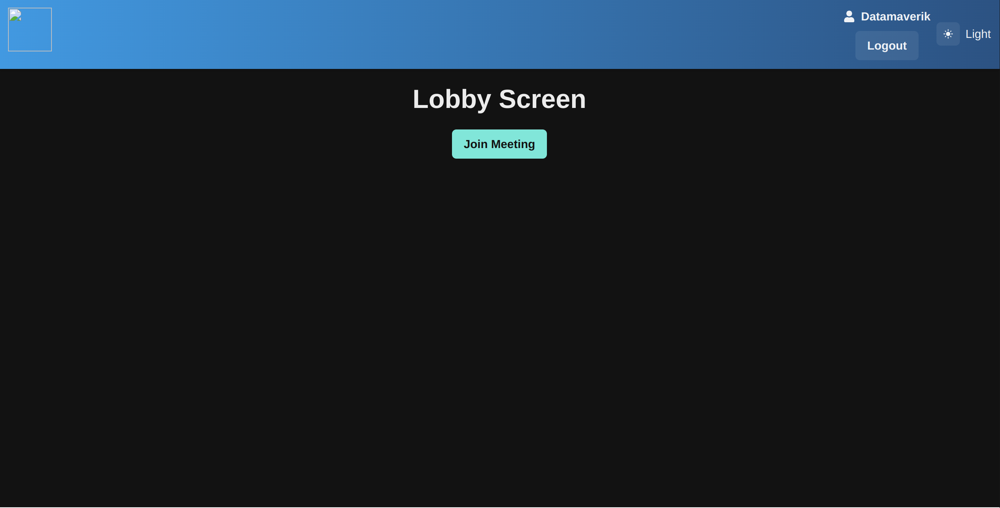
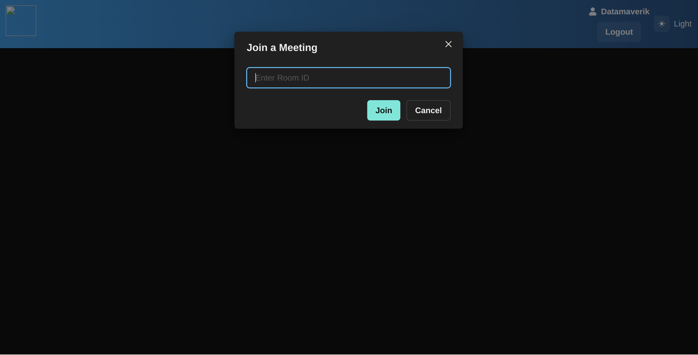
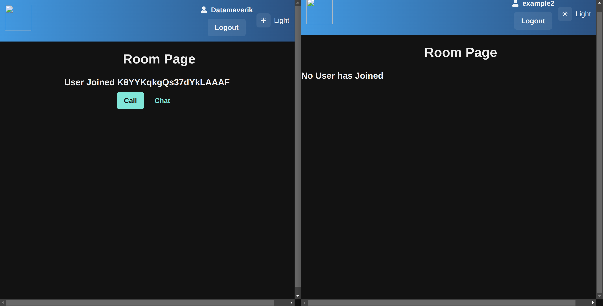
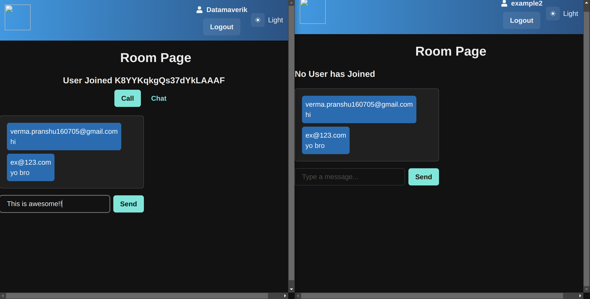
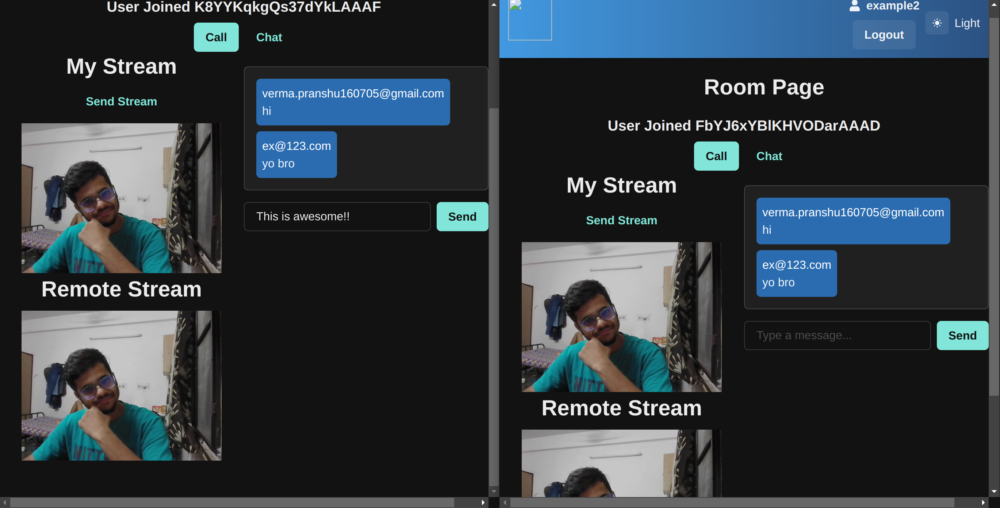

# **D-Meet App**

Welcome to the D-Meet app, a sophisticated video conferencing application built with the MERN stack and TypeScript. This app leverages modern technologies to offer seamless video calling, chat functionality, and robust user authentication.

## **Table of Contents**

- [**D-Meet App**](#d-meet-app)
  - [**Table of Contents**](#table-of-contents)
  - [**Project Overview**](#project-overview)
  - [**Features**](#features)
  - [**Tech Stack**](#tech-stack)
  - [**Setup and Installation**](#setup-and-installation)
  - [**Usage**](#usage)
  - [**OAuth 2.0 Integration**](#oauth-20-integration)
  - [**How It Works**](#how-it-works)
  - [**Screenshots**](#screenshots)

## **Project Overview**

The Video Meet App is a powerful video conferencing solution that allows users to create rooms, join rooms, and interact via video calls and chat. Built using a rich tech stack, the app provides a robust and scalable solution for virtual meetings.

## **Features**

- **User Authentication:** Secure login and logout with GitHub OAuth 2.0 integration.
- **Room Management:** Create and join rooms with unique IDs.
- **WebRTC Integration:** Establish peer-to-peer connections for video calls.
- **Real-Time Communication:** Use Socket.IO for real-time chat and connection management.
- **Robust Validation:** Four levels of validation implemented for both frontend and backend.

## **Tech Stack**

- **Frontend:**
   React, TypeScript, Chakra UI,
- **Backend:**  Node.js, Express,
   TypeScript
- **Database:**  MongoDB,
- **Authentication:**  OAuth2.0,  GitHub Login
- **Real-Time Communication:**  Socket.IO,  WebRTC
- **Validation:**  Zod,  Joi, Joi Password Complexity

## **Setup and Installation**

To get started with the Video Meet App, follow these steps:

1. **Clone the Repository:**
   ```bash
   git clone https://github.com/Datamaverik/D-Meet
   ```
2. **Navigate to the Project Directory**

```bash
cd D-Meet-App
```

3. **Install Dependencies**
   ```bash
   npm install
   ```
4. **Set Up Environment Variables**
   Create a `.env` file in the root directory of `Server` and add the necessary environment variable. Refer to `.env.example` for required variables.
5. **Start the Application**
   ```bash
   cd Server
   npm start
   ```
   Opent a new terminal in the root directory
   ```bash
   cd Client
   npm run dev
   ```
6. **Access the App:**
   Open your browser and navigate to `http:localhost:5173`.

## **Usage**

- **Login:** Use your GitHub account to log in.
- **Create Room:** Generate a unique ID and share it with other.
- **Join Room:** Enter the room ID to join an existing room.
- **Video Call:** Connect with others in the room using WebRTC.
- **Chat** Send and recieve real-time messages in the chat window.

## **OAuth 2.0 Integration**

We’ve integrated GitHub OAuth 2.0 for seamless user authentication. Users can log in using their GitHub credentials, enhancing security and user experience.

## **How It Works**

1. **User Authentication:** User login via GitHub OAuth 2.0 or normal register themselves to the MongoDB
2. **Room Creation:** Users create or join rooms using unique IDs.
3. **WebRTC Connection:** WebRTC is used for video and audio communication.
4. **Reat-Time Communication:** Socket.IO manages real-time chant and signalling.

## **Screenshots**

- **Login/Signup Page**
  
  

- **Validation**
  

- **Lobby Page**
  

- **Room-Joining**
  
- **Room Page**
  

- **Chat Page**
  

- **Call Page**
  
